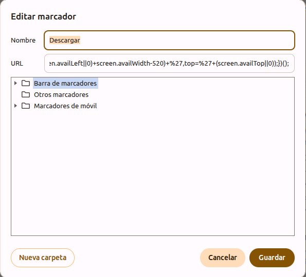
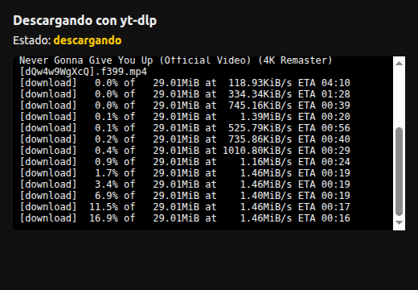
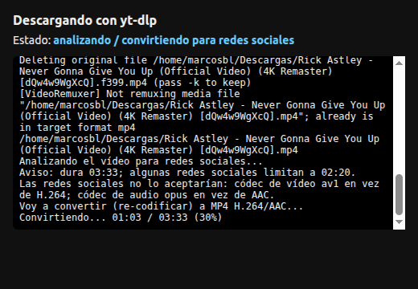
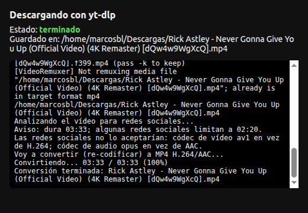
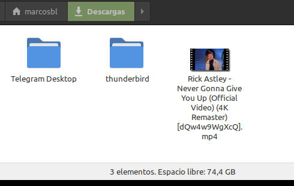

# chrome-videos

> 🇬🇧 [English version](README.md)

Un marcador (bookmarklet) en Chrome que descarga con `yt-dlp` el vídeo que estás viendo.
Al pulsarlo se abre una ventana pequeña con el progreso. Al terminar la descarga analiza el
vídeo y, si las redes sociales no lo aceptarían, lo convierte a MP4 H.264/AAC mostrando el progreso en
la misma ventana. Cuando todo acaba muestra la ruta del archivo, abre la carpeta de destino
con el vídeo seleccionado y la ventana se cierra sola.

Todos los mensajes (ventana de progreso, logs, instalador) se muestran en español si el
sistema está en español, y en inglés en cualquier otro caso.

## Vídeo de demostración

https://github.com/user-attachments/assets/475f7b8f-7c45-40f4-83aa-410be783e454

[Descargar el MP4](docs/demo.mp4)

## Capturas

| Marcador en Chrome | Descargando |
| --- | --- |
|  |  |

| Convirtiendo para redes sociales | Terminado |
| --- | --- |
|  |  |

Al acabar se abre el gestor de archivos con el vídeo descargado:



## Cómo funciona

- `server.py`: servicio HTTP en `127.0.0.1:8765` (solo accesible desde tu PC). Recibe la URL,
  lanza `yt-dlp` y guarda en tu carpeta de descargas (`xdg-user-dir DOWNLOAD`). Pide preferentemente
  H.264 + AAC con un máximo de 1080p (`-S res:1080,vcodec:h264,acodec:aac`), que es lo que aceptan
  las redes sociales sin convertir; si el sitio no lo ofrece, coge lo mejor disponible y la conversión
  posterior lo arregla.
- Cada petición lleva un token secreto (`~/.config/ytdlp-bookmarklet/token`) para que ninguna
  web pueda ordenar descargas sin tu clic.
- Tras descargar, `ffprobe` comprueba los requisitos habituales de las redes sociales: contenedor MP4, vídeo H.264
  (Baseline/Main/High, yuv420p), audio AAC, máximo 1920x1200 (o 1200x1920) y 60 fps.
  Si algo falla, `ffmpeg` re-codifica solo lo necesario (vídeo con libx264 perfil Main CRF 23,
  píxeles cuadrados con `setsar=1`, audio AAC 128k, o solo re-empaqueta si el problema es el
  contenedor) con `faststart`. Si el origen ya
  era `.mp4` conserva el nombre; si tenía otra extensión, deja el `.mp4` y borra el original.
  Si dura más de 2:20 solo avisa (algunas redes lo rechazan, pero no se recorta).
- Al acabar llama a `org.freedesktop.FileManager1.ShowItems` por D-Bus (Nemo, Nautilus,
  Dolphin...) para abrir la carpeta con el archivo seleccionado; si falla, usa `xdg-open`.
- `ytdlp-bookmarklet.service`: unidad de systemd de usuario para que arranque al iniciar sesión.
- yt-dlp necesita un runtime de JavaScript para resolver los desafíos de YouTube; sin él YouTube
  puede omitir formatos. El instalador busca `deno` en el PATH y, si no, el `node` más reciente
  (PATH o nvm), y se lo pasa al servidor como `--js-runtime`. Se puede forzar con `JS_RUNTIME=deno`
  o `JS_RUNTIME=node:/ruta/a/node`.

## Idioma

El idioma se detecta de `LANGUAGE`, `LC_ALL`, `LC_MESSAGES` y `LANG` (en ese orden):
español si empieza por `es`, inglés en otro caso. Se puede forzar con `--lang es|en`
al ejecutar `server.py`. El instalador fija el idioma detectado en la unidad de systemd.

## Instalación

```sh
./install.sh
```

Variables opcionales: `PORT`, `DOWNLOAD_DIR`, `YTDLP`, `JS_RUNTIME`. El servidor acepta además `--ffmpeg`, `--ffprobe`, `--js-runtime` y `--lang`.

El script instala el servicio y escribe el código del marcador en `bookmarklet.txt`.

## Añadir el marcador en Chrome

1. Activa la barra de marcadores (Ctrl+Mayús+B).
2. Clic derecho en la barra → «Añadir página».
3. Nombre: `yt-dlp`. URL: pega el contenido de `bookmarklet.txt`.
4. Abre un vídeo de YouTube y pulsa el marcador.

## Operación

```sh
systemctl --user status ytdlp-bookmarklet   # estado
journalctl --user -u ytdlp-bookmarklet -f   # logs
python3 server.py --bookmarklet             # volver a imprimir el marcador
```

## Tests

```sh
python3 -m unittest discover -s tests -t .
```
