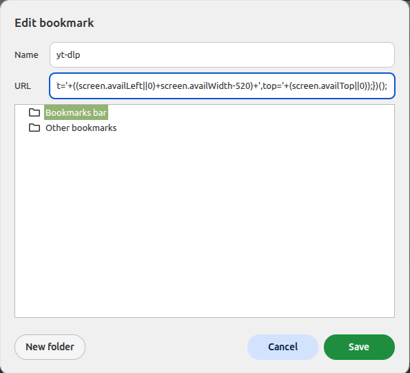
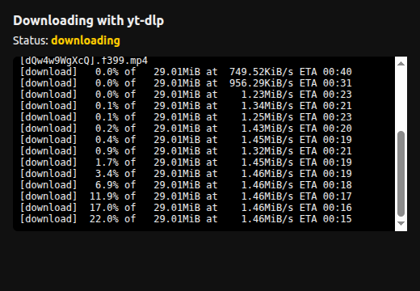
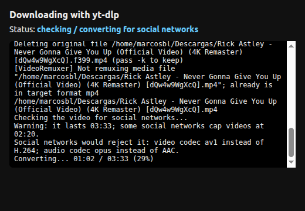
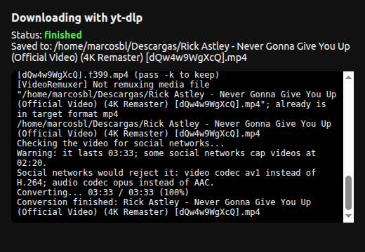
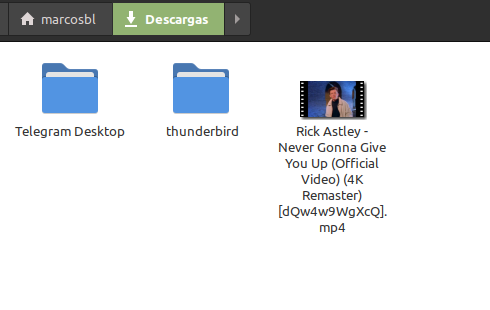

# chrome-videos

> 🇪🇸 [Versión en español](README.es.md)

A Chrome bookmarklet that downloads the video you are watching with `yt-dlp`.
Clicking it opens a small window with the progress. Once the download finishes it analyzes the
video and, if social networks would reject it, converts it to MP4 H.264/AAC showing the progress in
the same window. When everything is done it shows the file path, opens the destination folder
with the video selected, and the window closes by itself.

All messages (progress window, logs, installer) are shown in Spanish when the system
language is Spanish, and in English otherwise.

## Supported sites

Covers everything yt-dlp does, including:

- Major video platforms: YouTube, Vimeo, Dailymotion
- Social & short-form: Facebook, Instagram, TikTok, X/Twitter, Reddit
- Live streaming: Twitch (VODs, streams & clips), Kick
- Audio: SoundCloud, Bandcamp, Mixcloud
- News & TV: BBC, CNN & many international broadcasters

## Demo video

https://github.com/user-attachments/assets/475f7b8f-7c45-40f4-83aa-410be783e454

## Screenshots

| Bookmark in Chrome | Downloading |
| --- | --- |
|  |  |

| Converting for social networks | Finished |
| --- | --- |
|  |  |

When everything is done the file manager opens with the downloaded video:



## How it works

- `server.py`: HTTP service on `127.0.0.1:8765` (only reachable from your PC). It receives the URL,
  runs `yt-dlp` and saves to your downloads folder (`xdg-user-dir DOWNLOAD`). It prefers H.264 + AAC
  up to 1080p (`-S res:1080,vcodec:h264,acodec:aac`), which social networks accept without converting;
  if the site does not offer it, it takes the best available and the later conversion fixes it.
- Every request carries a secret token (`~/.config/ytdlp-bookmarklet/token`) so that no
  website can trigger downloads without your click.
- After downloading, `ffprobe` checks the usual social network requirements: MP4 container, H.264 video
  (Baseline/Main/High, yuv420p), AAC audio, at most 1920x1200 (or 1200x1920) and 60 fps.
  If anything fails, `ffmpeg` re-encodes only what is needed (video with libx264 Main profile CRF 23,
  square pixels with `setsar=1`, AAC 128k audio, or just remuxes if the problem is the
  container) with `faststart`. If the source was already `.mp4` it keeps the name; if it had another
  extension, it leaves the `.mp4` and deletes the original.
  If it lasts more than 2:20 it only warns (some networks reject it, but nothing is trimmed).
- When done it calls `org.freedesktop.FileManager1.ShowItems` over D-Bus (Nemo, Nautilus,
  Dolphin...) to open the folder with the file selected; if that fails, it uses `xdg-open`.
- `ytdlp-bookmarklet.service`: systemd user unit so it starts at login.
- yt-dlp needs a JavaScript runtime to solve YouTube's challenges; without one YouTube may omit
  formats. The installer looks for `deno` on the PATH, then for the newest `node` (PATH or nvm),
  and passes it to the server as `--js-runtime`. Force it with `JS_RUNTIME=deno` or
  `JS_RUNTIME=node:/path/to/node`.

## Language

The language is detected from `LANGUAGE`, `LC_ALL`, `LC_MESSAGES` and `LANG` (in that order):
Spanish if it starts with `es`, English otherwise. You can force it with `--lang es|en`
when running `server.py`. The installer bakes the detected language into the systemd unit.

## Install

```sh
./install.sh
```

Optional variables: `PORT`, `DOWNLOAD_DIR`, `YTDLP`, `JS_RUNTIME`. The server also accepts `--ffmpeg`, `--ffprobe`, `--js-runtime` and `--lang`.

The script installs the service and writes the bookmarklet code to `bookmarklet.txt`.

## Add the bookmark in Chrome

1. Show the bookmarks bar (Ctrl+Shift+B).
2. Right-click the bar → "Add page".
3. Name: `yt-dlp`. URL: paste the contents of `bookmarklet.txt`.
4. Open a YouTube video and click the bookmark.

## Operation

```sh
systemctl --user status ytdlp-bookmarklet   # status
journalctl --user -u ytdlp-bookmarklet -f   # logs
python3 server.py --bookmarklet             # print the bookmarklet again
```

## Tests

```sh
python3 -m unittest discover -s tests -t .
```
